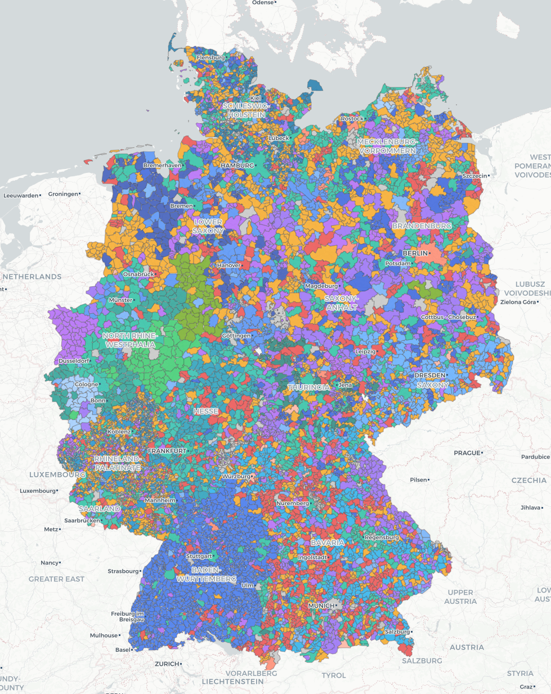
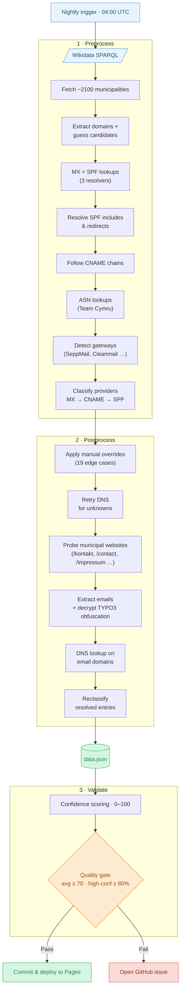

# MXmap — Where Swiss municipalities host their email

[](https://github.com/davidhuser/mxmap/actions/workflows/ci.yml)
[](https://github.com/davidhuser/mxmap/actions/workflows/nightly.yml)

An interactive map showing where Swiss municipalities host their email — whether with US hyperscalers (Microsoft, Google, AWS) or Swiss providers or other solutions.

**[View the live map](https://mxmap.ch)**

[](https://mxmap.ch)

## How it works

The data pipeline has three steps:

1. **Preprocess** -- Fetches all ~2100 Swiss municipalities from Wikidata, performs MX and SPF DNS lookups on their official domains, and classifies each municipality's email provider.
2. **Postprocess** -- Applies manual overrides for edge cases, retries DNS for unresolved domains, then scrapes websites of still-unclassified municipalities for email addresses.
3. **Validate** -- Cross-validates MX and SPF records, assigns a confidence score (0-100) to each entry, and generates a validation report.



## Quick start

```bash
uv sync

uv run preprocess
uv run postprocess
uv run validate

# Serve the map locally
python -m http.server
```

## Development

```bash
uv sync --group dev

# Run tests with coverage
uv run pytest --cov --cov-report=term-missing

# Lint the codebase
uv run ruff check src tests
uv run ruff format src tests
```

## Related work

* [hpr4379 :: Mapping Municipalities' Digital Dependencies](https://hackerpublicradio.org/eps/hpr4379/index.html)
* if you know of other similar projects, please open an issue or submit a PR to add them here!

## Contributing

If you spot a misclassification, please open an issue with the BFS number and the correct provider.
For municipalities where automated detection fails, corrections can be added to the `MANUAL_OVERRIDES` dict in `src/mail_sovereignty/postprocess.py`.