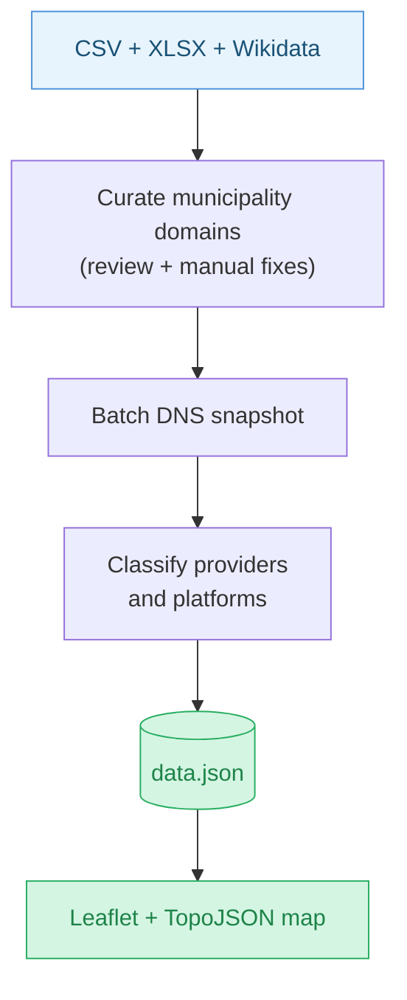

# MXatlas — Email Providers of German Municipalities

An interactive map showing where German municipalities host their email infrastructure — whether with US hyperscalers, municipal IT providers, commercial hosters or other setups.

**[View the live map](https://mxatlas.de)**

[](https://mxatlas.de)

## Current status

This repository currently publishes a static snapshot. The map is not rebuilt continuously from live DNS or live municipality data.

The current Germany dataset was built in three stages:

1. **Domain curation** -- Municipality domains were assembled from Wikidata website hints and then cleaned up with deterministic review steps and manual corrections for ambiguous cases.
2. **DNS snapshot** -- DNS records for the curated domain set were queried in batch and stored as a point-in-time snapshot.
3. **Classification** -- The DNS snapshot was mapped to provider/platform classes and exported into the static frontend data files.

The published provider labels should be read as indicative technical classifications derived from public DNS signals, not as official statements by the municipalities.



## Quick start

```bash
uv sync

# Rebuild data.json from the checked CSV snapshot
uv run build-data-de

# or rebuild the committed site data in-place
uv run build-site-de

# Serve the map locally
python -m http.server
```

## Development

```bash
uv sync --group dev

# Run tests with coverage
uv run pytest --cov --cov-report=term-missing

# Lint the codebase
uv run ruff check src tests
uv run ruff format src tests
```

## Related work

* [hpr4379 :: Mapping Municipalities' Digital Dependencies](https://hackerpublicradio.org/eps/hpr4379/index.html)
* if you know of other similar projects, please open an issue or submit a PR to add them here!

## Contributing

If you spot a misclassification, please open an issue with the municipality key (`gkz8 / Gemeindekennzahl`) and the expected provider.

## Sources and licensing

- Destatis / Statistikportal municipality reference data, used in modified form
- Wikidata (CC0)
- © GeoBasis-DE / BKG geometry data, license `dl-de/by-2-0`, used in modified form
- DNS snapshot, joins and provider classifications by this project

See [DATA_SOURCES.md](DATA_SOURCES.md) for the current source and methodology notes.

## Automation strategy

- `build-data-de` rebuilds `data.json` from the committed Germany classification CSV snapshot.
- `municipalities.topo.json` is currently treated as a checked-in static asset, not a nightly-generated artifact.
- The published site is currently a static snapshot rather than a continuously refreshed pipeline.
- GitHub Actions should deploy already-reviewed assets rather than re-running domain discovery or DNS collection automatically.
